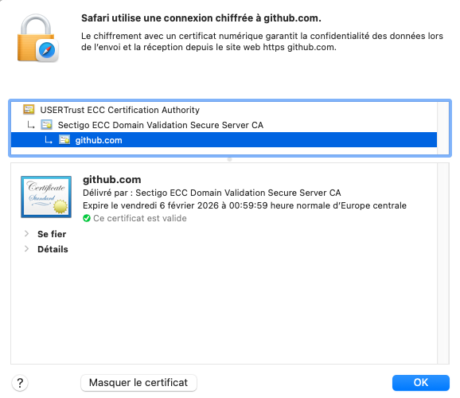

## Introduction : Le Cadenas, Votre Indice de Confiance 🕵️‍♂️✨

Vous l'avez vu des milliers de fois, n'est-ce pas ? Ce petit **cadenas vert** (ou parfois gris, selon votre navigateur et le site) qui se présente à côté de l'adresse d'un site web dans votre barre de navigation. On clique dessus, on le voit, on se dit "cool, c'est sécurisé", et on passe à autre chose.

Mais... savez-vous vraiment ce qu'il signifie ? 🤔 Toute la **mécanique qui se déclenche** rien que pour que ce petit symbole s'affiche ? C'est bien plus qu'une simple icône ! C'est la partie visible d'un iceberg. \
**Alors, quelle est notre mission aujourd'hui ? 🚀**

On va enfiler nos gants et analyser se qu'il se passe "sous le capot" ! Promis, on va expliquer de façon **claire, simple, et sans jargon indigeste** ce qui se passe réellement quand ce cadenas apparaît. On va décortiquer ensemble comment il nous aide à savoir si on peut faire confiance à un site et pourquoi c'est absolument **ESSENTIEL** pour notre "sécurité".

Préparez-vous, car vous allez voir que derrière ce petit cadenas se cache une danse complexe de certificats, de clés secrètes, et de poignées de main... Et à la fin, vous ne regarderez plus jamais ce petit symbole de la même manière.

## Partie 1 : Le Certificat SSL 💳

Alors, ce fameux certificat SSL, c'est quoi au juste ? Accrochez-vous, car c'est la première pièce du puzzle !

### Qu'est-ce que c'est ? 🤔

Imaginez le certificat SSL (ou TLS, on y reviendra !) comme la **carte d'identité numérique officielle d'un site web**. Quand vous la présentez à la gendarmerie 👮, elle prouve qui vous êtes. \
Eh bien, pour un site web, c'est pareil !

Son rôle ? Prouver que le site que vous visitez est bien celui qu'il prétend être, et pas un imposteur 🥸. \
C'est la première garantie que vous n'êtes pas en train de vous faire avoir par un site de phishing bien déguisé.

> [!NOTE] **Petite Précision Linguistique 🤓 : SSL ou TLS ?**
>
> On entend souvent parler de "certificat SSL". En réalité, SSL (Secure Sockets Layer) est l'ancêtre du protocole actuel, qui s'appelle **TLS (Transport Layer Security)**. \
> Mais comme "SSL" est resté populaire (un peu comme "Frigidaire" pour parler d'un réfrigérateur), on l'utilise encore beaucoup. \
> Dans cet article, on jonglera entre "certificat SSL" et "certificat TLS", mais sachez qu'on parle bien de la technologie moderne et sécurisée !

### Qui le délivre ? L'Autorité de Certification (CA) 🏛️

Mais qui fabrique et distribue ces cartes d'identité ? Ce sont les **Autorités de Certification (CA)**. \
Pensez à elles comme à des **"mairies"**.

Avant de vous donner une carte d'identité, votre mairie vérifie qui vous êtes, n'est-ce pas ? Eh bien, les CA font pareil pour les sites web ! Elles s'assurent de l'identité du demandeur avant de lui délivrer ce précieux sésame. Des noms comme **Let's Encrypt**, **Sectigo**, ou **DigiCert**, ça vous dit quelque chose ? Ce sont des exemples de ces organismes de confiance.

Et comment votre navigateur (Chrome, Firefox, Safari...) sait-il qu'il peut faire confiance à une CA ? C'est simple : il possède une **liste pré-installée de CA reconnues et fiables**. Un peu comme avoir la liste des mairies officielles du pays ! Si le certificat est signé par une CA de cette liste, le navigateur dit "OK, celle-là, je la connais, je lui fais confiance".

> [!TIP] **Tous les Cadenas ne Cachent Pas la Même Enquête 🕵️‍♀️**
> Il existe différents "niveaux de contrôle" avant qu'une CA ne délivre un certificat. On parle de :
>
> * **DV (Domain Validation) :** Le plus basique. La CA vérifie juste que le demandeur contrôle bien le nom de domaine (genre, "est-ce que vous avez les clés de `arnodo.fr` ?"). C'est rapide et souvent gratuit (merci Let's Encrypt !).
> * **OV (Organization Validation) :** Là, on monte d'un cran. La CA vérifie l'existence légale de l'organisation qui demande le certificat (nom de l'entreprise, adresse...).
> * **EV (Extended Validation) :** Le top du top de la vérification ! La CA mène une enquête approfondie sur l'identité de l'entreprise. Avant, cela se traduisait souvent par l'affichage du nom de l'entreprise en vert à côté du cadenas. Aujourd'hui, les navigateurs tendent à simplifier cet affichage, mais la rigueur de la vérification reste.
> Le petit cadenas sera là pour tous ces types, mais des informations supplémentaires sur l'organisation peuvent être visibles en cliquant dessus pour les certificats OV/EV.

### Que contient-il 📜

Concrètement, qu'est-ce qu'on trouve dans cette fameuse carte d'identité numérique ? Les informations essentielles sont :

* **Le nom du domaine concerné :** Par exemple, `notebook.arnodo.fr`. C'est crucial pour s'assurer que vous êtes au bon endroit.
* **Le nom de l'organisation propriétaire :** Surtout visible et vérifié pour les certificats OV et EV. Ça vous donne une idée de qui est derrière le site.
* **La clé publique du serveur :** 🔑 C'est un morceau de code ultra-important ! On va voir son rôle dans la partie 2, mais retenez qu'elle est ici, bien au chaud dans le certificat. C'est un peu l'adresse de notre boîte aux lettres.
* **La signature numérique de la CA :** C'est le tampon officiel de la "mairie" (la CA) qui prouve que le certificat est authentique et n'a pas été modifié ou falsifié depuis sa délivrance.
* **Les dates de validité :** Comme votre permis de conduire ou votre passeport, un certificat a une date de début et une date de fin. Un certificat expiré, c'est un gros NON 🚩 pour votre navigateur !

### Comment votre navigateur le vérifie-t-il ? ⏱️💨

Tout ça, c'est bien beau, mais comment votre navigateur fait-il pour vérifier tout ça en un clin d'œil (souvent en quelques millisecondes à peine !) quand vous arrivez sur un site ? C'est une petite danse bien huilée, une sorte de "check-up" express :

1. **Vérification de la signature de la CA :** Le navigateur regarde la signature apposée sur le certificat. Grâce à sa liste de CA de confiance (et leurs propres "clés publiques" à elles, qu'il connaît), il peut s'assurer que la signature est authentique et que le certificat vient bien d'une autorité reconnue. C'est comme vérifier le sceau sur un document officiel.
2. **Pas périmé, s'il vous plaît ! :** Il vérifie que le certificat n'est pas encore expiré (et qu'il est même déjà valide, s'il y a une date de début dans le futur). Un certificat périmé, c'est comme montrer un passeport qui n'est plus bon : direction la sortie !
3. **Pas sur la liste noire (révocation) :** Le navigateur s'assure que le certificat n'a pas été révoqué. "Révoqué ?" Oui, ça veut dire annulé avant sa date d'expiration. Ça peut arriver si, par exemple, le site s'est fait pirater et que sa clé privée (le secret du serveur, on en reparle bientôt) a été compromise. La CA publie alors des listes de certificats annulés (appelées CRL ou via OCSP) que les navigateurs consultent.
4. **Bon site, bon certificat :** Il vérifie que le nom de domaine indiqué dans le certificat (par exemple `www.votresiteprefere.com`) correspond EXACTEMENT au site que vous essayez de joindre. Pas de triche ou d'arnaque à l'identité !

🏁 **Le Verdict :**

* **Si tout est OK 👍 :** Le petit cadenas vert (ou gris, selon le navigateur) s'affiche fièrement ! La connexion est jugée sûre, et vous pouvez naviguer, acheter, ou entrer vos informations l'esprit (relativement) tranquille.
* **Si quelque chose cloche 👎 :** Votre navigateur va tirer la sonnette d'alarme ! 🚨 Vous verrez un message d'avertissement bien visible (du genre "Votre connexion n'est pas privée", "Alerte de sécurité", etc.).
    > [!WARNING] **Alerte Rouge !**
    > Un conseil d'ami : **n'ignorez JAMAIS ces avertissements**, surtout si vous comptiez entrer des informations sensibles (identifiants, coordonnées bancaires...).
    > C'est souvent le signe que quelque chose de louche se trame !

Et voilà pour la carte d'identité ! Mais ce n'est que le début. Maintenant qu'on sait que le site est bien qui il prétend être, comment fait-on pour que nos échanges avec lui restent secrets ? C'est là qu'intervient la magie des clés... et c'est le sujet de notre prochaine partie !

## Partie 2 : La Danse des Clés 💃🔑

Bon, maintenant on sait que le site est bien celui qu'il prétend être grâce à sa carte d'identité (le certificat SSL/TLS, vous vous souvenez ?). C'est super, mais ça ne suffit pas ! Si nos échanges avec ce site se baladent en clair sur internet, n'importe quel petit curieux (ou pirate 🏴‍☠️) pourrait les lire. Pas top si vous envoyez votre numéro de carte bleue ou vos mots de passe les plus secrets !

C'est là qu'intervient la deuxième phase de la magie : **le chiffrement des données**. Et pour ça, on va assister à une véritable "danse des clés" !

### Introduction à la Magie : La Cryptographie Asymétrique

Pour que nos données deviennent un charabia illisible pour les autres, on utilise un concept génial appelé **cryptographie asymétrique**. Késako ? C'est l'idée d'avoir non pas une, mais **deux clés numériques** qui fonctionnent ensemble, comme un duo inséparable :

1. **Une Clé Publique :** 🌍 Imaginez-la comme une **boîte aux lettres avec une fente ouverte à tous**. Elle est partagée ouvertement avec le monde entier (elle est même incluse dans le certificat SSL du site, celui qu'on a vu en Partie 1 !). N'importe qui peut l'utiliser pour y déposer un message (chiffré, bien sûr).
2. **Une Clé Privée :** 🤫 Celle-ci, c'est le **trésor du serveur**. Elle est gardée précieusement et ne doit JAMAIS être divulguée. C'est la **SEULE clé capable d'ouvrir la boîte aux lettres** et de lire les messages qui ont été chiffrés avec la clé publique correspondante.

En gros : ce qui est chiffré (verrouillé) avec la clé publique ne peut être déchiffré (déverrouillé) QUE par la clé privée correspondante. Et inversement (même si pour notre "handshake", c'est surtout le premier sens qui nous intéresse). Malin, non ?

### Le "Handshake" SSL/TLS simplifié

Maintenant qu'on a nos clés, comment votre navigateur et le serveur se mettent-ils d'accord pour parler en secret ? C'est grâce à une négociation initiale, une sorte de "poignée de main" codée qu'on appelle le **SSL/TLS Handshake**. Voici les étapes, simplifiées pour ne pas vous donner mal au crâne :

1. **Votre Navigateur 💻 :** "Salut Serveur ! Je voudrais bien qu'on discute de manière sécurisée. Tu peux me montrer ta carte d'identité (ton certificat SSL/TLS), s'il te plaît ?"
2. **Le Serveur 🖥️ :** "Pas de souci, l'ami ! Voilà mon certificat. Tu y trouveras ma fameuse **clé publique** (notre `boîte aux lettres`)."
3. **Votre Navigateur 💻 :** (Il examine le certificat sous toutes les coutures, comme on l'a vu en Partie 1 : signature de la CA, date d'expiration, nom de domaine, pas révoqué... Bref, le grand check-up !)
4. **Si le certificat est valide et digne de confiance ✅ :**
    * Votre navigateur se dit : "OK, ce gars est réglo ! Maintenant, il faut qu'on trouve un code secret juste pour nous deux pour la suite de la conversation."
    * Il crée alors une petite information secrète temporaire, une sorte de mot de passe unique pour cette session : c'est la **clé de session**. (C'est une clé dite *symétrique*, différente de notre paire publique/privée, car elle est plus rapide pour chiffrer de gros volumes de données).
    * Pour envoyer cette clé de session au serveur sans que personne ne puisse la voir, votre navigateur va utiliser la **clé publique du serveur** (celle qu'il a trouvée dans le certificat) pour la chiffrer. Hop, la clé de session est mise dans une "enveloppe sécurisée" que seul le serveur pourra ouvrir !
    * Il envoie cette clé de session chiffrée au serveur.
5. **Le Serveur 🖥️ :** Il reçoit l'enveloppe sécurisée. Comment l'ouvrir ? Facile ! Il utilise sa **clé privée** (celle qu'il garde jalousement secrète) pour déchiffrer la clé de session envoyée par votre navigateur. Et comme il est le seul à avoir cette clé privée... il est le seul à pouvoir lire la clé de session !
6. **Mission Accomplie ! 🎉** Magie ! Votre navigateur et le serveur possèdent maintenant **exactement la même clé de session secrète**. Personne d'autre sur le réseau ne la connaît.

À partir de ce moment, **toutes les données échangées** entre votre navigateur et le serveur pour le reste de votre visite (les pages que vous chargez, les formulaires que vous envoyez, etc.) seront **chiffrées et déchiffrées avec cette clé de session**. C'est beaucoup plus rapide d'utiliser cette clé symétrique pour les échanges continus que de continuer avec le système de clé publique/privée (qui est un peu plus lourd pour de grandes quantités de données).

La communication est désormais sécurisée, chiffrée de bout en bout ! 🔒 Vous pouvez souffler, vos secrets sont (normalement) bien gardés !

## Partie 3 : Pourquoi Tout Cela Est Essentiel Pour Vous ? 🛡️🌍

OK, on a vu la carte d'identité du site (le certificat) et la danse secrète des clés pour chiffrer nos conversations (le handshake SSL/TLS). \
Mais concrètement, pourquoi se donner autant de mal ?

### Pour Vous, en Tant qu'Utilisateur

Quand vous naviguez sur un site affichant fièrement ce cadenas (et donc utilisant HTTPS), vous bénéficiez de plusieurs protections vitales :

1. **Confidentialité 🤫 : Vos Secrets Bien Gardés !**
    C'est le bénéfice le plus évident. Grâce au chiffrement (cette fameuse clé de session qu'on a établie), vos informations sensibles deviennent un charabia indéchiffrable pour quiconque tenterait d'espionner votre connexion.
    * **Mots de passe ?** Chiffrés.
    * **Numéros de carte bancaire lors d'un achat ?** Chiffrés.
    * **Messages privés sur un forum ou un réseau social ?** Chiffrés.
    Même si un pirate 🏴‍☠️ arrivait à intercepter les données qui transitent entre votre ordinateur et le site, il ne verrait qu'une bouillie de caractères incompréhensibles. Vos informations restent privées, à l'abri des regards indiscrets.

2. **Intégrité✅ : Ce que Vous Voyez est Ce que Vous Devez Voir !**
    Le protocole HTTPS garantit aussi que les données que vous recevez du site (et celles que vous envoyez) n'ont **pas été modifiées ou corrompues en cours de route** par un tiers malveillant.

3. **Authentification 🆔 : Vous Parlez Bien au Bon Guichet !**
    Grâce au certificat SSL/TLS, vous avez une bien meilleure assurance que vous communiquez **avec le site légitime et non avec un clone frauduleux**.

### Pour les Propriétaires de Sites Web 👑

Si vous avez un site web, mettre en place HTTPS n'est plus un "nice-to-have", c'est devenu un "must-have". Voici pourquoi :

1. **Instaurer la Confiance (et Augmenter les Conversions !) 😊➡️💰**
    Le cadenas rassure immédiatement vos visiteurs. Ils voient que vous prenez leur sécurité au sérieux. C'est absolument crucial pour l'e-commerce (qui voudrait entrer ses infos bancaires sur un site non sécurisé ?), les services bancaires en ligne, ou tout site qui collecte la moindre donnée personnelle. Un site non sécurisé peut faire fuir les visiteurs avant même qu'ils n'aient exploré votre contenu, impactant directement votre crédibilité et, potentiellement, vos ventes ou vos objectifs.

2. **Améliorer le Référencement (SEO) 📈 : Google Aime les Sites Sécurisés !**
    Depuis plusieurs années, Google et d'autres moteurs de recherche **favorisent activement les sites en HTTPS** dans leurs résultats de recherche. Passer votre site en HTTPS peut donc vous donner un petit coup de pouce dans les classements. À l'inverse, ne pas le faire pourrait vous pénaliser.

3. **Protéger Vos Utilisateurs (et Votre Réputation !) 🛡️**
    En sécurisant les échanges, vous protégez vos utilisateurs contre le vol de leurs données personnelles. Éviter une fuite de données ou une usurpation d'identité qui aurait pour origine une faille de sécurité sur votre site, c'est aussi protéger votre propre réputation. Une mauvaise presse à ce sujet peut être dévastatrice.

4. **Conformité Réglementaire ⚖️ : Parfois, C'est la Loi !**
    Pour certaines activités et dans certaines régions (pensez au RGPD en Europe, par exemple), la sécurisation des données personnelles collectées et traitées est une **obligation légale**. Ne pas s'y conformer peut entraîner de lourdes sanctions. HTTPS est une des briques fondamentales de cette conformité.

En bref, ce petit cadenas, c'est un signe de respect envers vos utilisateurs, un gage de sérieux pour votre activité, et une protection pour tout le monde. Pas mal pour une si petite icône, non ? 😉

## Conclusion 🛡️✨

Alors, ce petit cadenas vert (ou gris) qu'on a décortiqué sous toutes ses coutures, c'est finalement bien plus qu'un simple détail graphique, n'est-ce pas ? On l'a vu, c'est la **partie visible d'un ingénieux et complexe système** qui travaille d'arrache-pied en coulisses.

Pour résumer notre voyage en quelques mots :

* Il commence par une **carte d'identité numérique** (le certificat SSL/TLS) qui nous assure que le site est bien celui qu'il prétend être, délivrée par une "mairie du web" de confiance (l'Autorité de Certification).
* Ensuite, c'est une **"danse des clés" cryptographiques** (la clé publique pour chiffrer un secret, la clé privée pour le déchiffrer) qui permet à votre navigateur et au serveur de se mettre d'accord sur un code secret unique (la clé de session).
* Et tout ça, pour quoi ? Pour garantir la **Confidentialité** (vos données restent secrètes), l'**Intégrité** (elles ne sont pas modifiées en chemin) et l'**Authentification** (vous parlez bien au bon site) de vos échanges sur le web.

Mais attention, la magie de TLS ne s'arrête pas aux portes de votre navigateur web ! Si le cadenas est son ambassadeur le plus connu, cette technologie est en réalité le **gardien silencieux de bien d'autres aspects de notre vie numérique** :

* **Vos emails 📧 :** Quand vous voyez des protocoles comme SMTPS, IMAPS, ou POP3S, c'est TLS qui sécurise l'envoi et la réception de vos messages.
* **Vos applications mobiles 📱 :** Beaucoup d'entre elles utilisent TLS pour communiquer de manière sécurisée avec leurs serveurs, protégeant les données qu'elles échangent.
* **Les VPN (Réseaux Privés Virtuels) 🌐 :** Certains protocoles VPN s'appuient sur TLS pour créer des tunnels chiffrés et sécuriser votre connexion internet globale.
* **La messagerie instantanée 💬 :** Des applications utilisent des mécanismes similaires ou directement TLS pour chiffrer vos conversations.
* **Et bien plus encore !** (Connexions à des bases de données, API sécurisées, etc.)

Bref, ce cadenas est la manifestation la plus visible de ce **garde du corps numérique personnel** 🕵️‍♂️, mais la technologie TLS elle-même œuvre dans bien d'autres recoins pour protéger vos informations.

**Alors, le mot de la fin ?**

Prenez l'habitude de **toujours vérifier la présence de ce cadenas** (et donc du "HTTPS" dans l'adresse) avant de saisir la moindre information sensible ou de télécharger quoi que ce soit sur un site web. N'hésitez pas à **cliquer dessus pour obtenir plus d'informations** si vous avez un doute. Et surtout, soyez **extrêmement vigilants face aux messages d'avertissement de sécurité** que votre navigateur pourrait afficher. Ils sont là pour une bonne raison !
