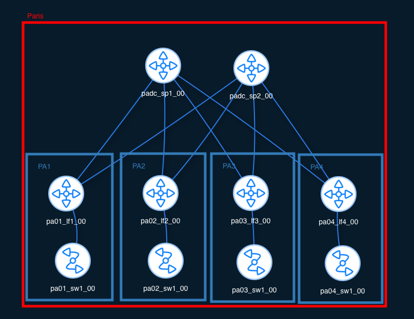

## Introduction 📚

Dans cet article, nous allons explorer comment automatiser le déploiement d'une infrastructure VXLAN en nous appuyant sur **Netbox** comme source unique de vérité (*Source of Truth*) et sa fonctionnalité de **"Render Config"**.

L'idée principale de ce projet est de simplifier la gestion des configurations réseau en limitant le recours à des outils d'orchestration externes, qui peuvent parfois complexifier la gestion des inventaires. Nous allons démontrer comment Netbox peut générer automatiquement les configurations de nos équipements réseau à partir de modèles Jinja2, à condition de respecter un principe fondamental : **la standardisation de notre infrastructure.** 💡

Pour illustrer cette approche, nous allons prendre l'exemple d'un site fictif, **"Paris"**, conçu selon des règles de standardisation claires et précises. Cette normalisation nous permettra de :

1. **Modéliser** l'ensemble de l'infrastructure du site "Paris" dans Netbox (bâtiments, clients, fabric).
2. **Générer** les configurations des équipements réseau en se basant sur les informations centralisées dans Netbox.
3. **Valider** le bon fonctionnement de cette infrastructure automatisée à l'aide d'un environnement de laboratoire **NetLab** sous ContainerLab.

À travers cet exemple concret, nous mettrons en lumière que la standardisation n'est pas une contrainte, mais plutôt le **socle indispensable** pour une automatisation réussie et une gestion réseau simplifiée et efficace.

Alors, prêt à découvrir comment la standardisation ouvre la voie à une automatisation intelligente de votre réseau VXLAN avec Netbox ? C'est parti ! 🚀😊

> [!NOTE] **CookBook**
> L'ensemble des actions décrites dans cet article sont expliqués [ici](https://github.com/darnodo/projet-vxlan-automation/blob/dev/documentation/CookBook.md#-apply-templates)  
> Cette article nous fournira pas un guide étape par étape, mais fournira le lien vers le Cookbook qui lui, le fourni.

## Le Concept du Site Standardisé ⚙️

L'automatisation efficace d'une infrastructure réseau repose sur une base solide de standardisation. Pour illustrer ce principe, nous avons défini un modèle de **site standard**, caractérisé par une structure et des règles de connectivité précises. Notre site "Paris" sera une instance concrète de ce modèle standardisé.

### Structure Type d'un Site Standard 🏢

Un site standard est défini par les éléments suivants :

* **Une Salle Serveur Centrale :** Unique au sein du site, elle héberge les deux spines de la fabric (Spine 1 et Spine 2), constituant le cœur de l'infrastructure réseau.
* **Un à Cinq Bâtiments Plain-Pied :** Chaque bâtiment est dédié à l'hébergement d'un seul client (bien que des clients puissent être répartis sur plusieurs bâtiments). Chaque bâtiment standard est équipé d'un switch d'accès pour la connectivité locale et d'un unique leaf pour la connexion à la fabric.

### Connectivité Standard des Leafs 🔗

Dans un site standard, la connexion des équipements leaf aux spines suit les règles suivantes :

* **Interface Eth1 du Leaf :** Systématiquement connectée à l'interface Eth1 du Spine 1.
* **Interface Eth2 du Leaf :** Systématiquement connectée à l'interface Eth2 du Spine 2.
* **Interface Eth3 du Leaf :** Systématiquement dédiée à la connexion au switch d'accès présent dans le même bâtiment.


> [!NOTE] Simplification pour le POC
> Pour les besoins de ce Proof of Concept, nous avons opté pour une architecture simplifiée sans redondance avancée au niveau des connexions leaf-spine.  
> L'objectif principal est de démontrer l'automatisation basée sur cette structure standardisée.

### Plan d'Adressage IP pour le Site "Paris" 🌐

Pour notre site "Paris", nous allons utiliser les conteneurs de préfixes Netbox suivants, qui s'inscrivent dans notre stratégie d'adressage globale :

* **Location :**
  * Région : Europe
  * Ville : Paris
* **Conteneurs de Préfixes :**
  * **UnderlayContainer (Paris) :**
    * CIDR : `172.16.0.0/16`
    * Description : "Préfixe conteneur pour le réseau Underlay du site de Paris"
  * **LoopbackContainer (Paris) :**
    * CIDR : `192.168.100.0/24`
    * Description : "Préfixe conteneur pour les adresses Loopback des équipements du site de Paris"
  * **CustomersContainer (Paris) :**
    * CIDR : `10.0.0.0/8`
    * Description : "Préfixe conteneur pour l'adressage des clients du site de Paris"

Ces conteneurs de préfixes sont spécifiques au site de "Paris" et seront utilisés par nos scripts d'automatisation pour attribuer les adresses IP aux différents équipements et clients de ce site, en respectant la structure standard que nous avons définie.

## Le Site "Paris" : Une Instance de Notre Modèle Standardisé 📍

Notre site "Paris" suit scrupuleusement la structure et les règles définies dans notre modèle de site standard. Il comprendra donc une salle serveur avec les deux spines et pourra accueillir jusqu'à cinq bâtiments plain-pied, chacun équipé d'un leaf et d'un switch d'accès, connectés selon les conventions établies. L'adressage IP de "Paris" sera issu des conteneurs de préfixes standard que nous avons définis.

Cette standardisation est la clé qui nous permettra d'automatiser la création et la configuration de l'infrastructure de notre site "Paris" à l'aide des scripts que nous allons présenter ensuite.

## Environment de test

Le POC se jouera sur ContainerLab, il est donc necessaire de se reférencer à [cette article](../../documentation/devpod) afin de facilement reproduire l'installation et les outils.

Nous utiliserons :

* ContainerLab
* Arista cEOS pour la partie Switch/routeur
* Netbox
  * Plugin : netbox_topology_views

Pour plus de détails, [voici la documentationation d'installation](https://github.com/darnodo/projet-vxlan-automation/blob/dev/documentation/INSTALLATION.md)

## Scripting : L'Automatisation en Action ! ⚙️

Maintenant, on entre dans le vif du sujet : comment on utilise des scripts pour automatiser la création de notre fabric VXLAN en s'appuyant sur Netbox. On va voir deux scripts principaux qui font le gros du boulot !

### Étape 1 : On Prépare Netbox avec `import.py` 🛠️

Avant de construire notre réseau, il faut préparer notre "Source of Truth", Netbox. Le script [`import.py`](https://github.com/darnodo/projet-vxlan-automation/blob/dev/documentation/CookBook.md#-populate-netbox) est là pour ça ! Il va injecter dans Netbox les infos de base de notre site "Paris" et les modèles de nos équipements.

**Les Ingrédients du Script :**

* **[`Devices/devices_model.yml`](https://github.com/darnodo/projet-vxlan-automation/blob/dev/utilities/Devices/devices_model.yml) :** La carte d'identité de nos équipements (spines, leafs, access cEOS) avec leurs caractéristiques (nombre d'interfaces, types, etc.).
* **[`IPAM/subnet.yml`](https://github.com/darnodo/projet-vxlan-automation/blob/dev/utilities/IPAM/subnets.yml) :** Les infos de notre site "Paris" (région Europe, ville Paris) et les plans de nos blocs d'adresses IP (pour l'underlay, les loopbacks et nos clients).

**Ce Que Fait le Script :**

* Il lit le fichier `devices_model.yml` et crée les modèles d'équipements correspondants dans Netbox. C'est comme enregistrer les types de matériel qu'on va utiliser.
* Il lit le fichier `IPAM/subnet.yml` et crée :
  * La région "Europe" et le site "Paris".
  * Les gros blocs d'adresses IP qu'on va utiliser pour notre réseau à Paris (nos "conteneurs de préfixes").

**Comment on Lance la Machine :**

On ouvre notre terminal et on tape la commande :

```bash
uv run import.py http://localhost:8080 YOUR_TOKEN Devices/devices_model.yml IPAM/subnet.yml
```

Remplace bien `http://localhost:8080` par l'adresse de ton Netbox et `YOUR_TOKEN` par ton jeton d'API Netbox ! Une fois lancé, ce script met en place les fondations de notre automatisation.

> [!TIP]
> Lien vers le Cookbook [ici](https://github.com/darnodo/projet-vxlan-automation/blob/dev/documentation/CookBook.md#-populate-netbox)

### Étape 2 : On Monte la Fabric VXLAN avec `Create_Fabric/main.py` 🚀

Maintenant que Netbox est prêt, on passe à la construction de notre réseau avec le script `Create_Fabric/main.py`. Ce script va créer tous les équipements, les connecter et leur attribuer des adresses IP, le tout en suivant notre modèle standardisé pour le site "Paris".

**Les Étapes du Script :**

1. **Vérification des Prêts ? ✅** Le script commence par vérifier si tout ce dont il a besoin existe dans Netbox (les rôles des équipements, les rôles IP, les types d'équipements). On ne veut pas commencer à construire sur des bases instables !
2. **Choix du Terrain : "Paris" Évidemment ! 🇫🇷** Le script nous demande sur quel site on travaille. On sélectionne "Paris", notre site standard. Son petit nom "PA" va servir de base pour nommer nos équipements.
3. **On Sort les Spines (x2) 💪** Le script crée nos deux spines dans Netbox, en utilisant le bon modèle et le rôle "spine". Ils sont baptisés `padc_sp1_00` et `padc_sp2_00`.
4. **Les Paires Leaf/Access par Bâtiment 🏢➡️** Pour chaque bâtiment de "Paris" (jusqu'à 5), le script crée une "location" Netbox et y installe un leaf (par exemple `pa01_lf1_00`) et un switch d'accès (par exemple `pa01_sw1_00`).
5. **Câblage Automatique 🧶** Le script connecte virtuellement les équipements dans Netbox en suivant nos règles : `Eth1` du leaf vers `Eth*n*` du Spine 1, `Eth2` du leaf vers `Eth*n*` du Spine 2, et `Eth3` du leaf vers `Eth1` de l'access switch. Plus besoin de s'embrouiller avec les câbles !
6. **Distribution des IPs 🗺️** Le script pioche dans les blocs d'adresses IP de "Paris" et attribue automatiquement les IPs aux interfaces (des /31 pour les liens entre les équipements et des /32 pour les loopbacks).
7. **Attribution des ASNs 🏷️** Pour finir, le script donne un numéro d'AS à chaque spine et à chaque leaf pour le routage BGP. Ces numéros sont enregistrés dans un champ spécial "ASN" dans Netbox.

```bash
uv run Create_Fabric/main.py
NetBox URL: http://localhost:8080                   
NetBox API Token: 
Number of buildings (1-5): 4
Spine device type slug: ceos
Leaf device type slug: ceos
Access switch device type slug: ceos

Existing Sites:
  1. Paris (slug=paris)
Choose site number or 'new': 1
```

**Le Résultat ? 🎉** En lançant ce script, on se retrouve avec toute notre infrastructure VXLAN de "Paris" créée et connectée dans Netbox, prête à être configurée ! C'est l'automatisation à son meilleur, rendue possible par notre approche standardisée.  

> [!NOTE] Netbox Plugin
> La configuration est facilement visualisable avec l'aide du plugin : [netbox_topology_views](https://github.com/netbox-community/netbox-topology-views)



> [!TIP]
> Lien vers le Cookbook [ici](https://github.com/darnodo/projet-vxlan-automation/blob/dev/documentation/CookBook.md#%EF%B8%8F-create-fabric)

### Étape 3 : On configure nos clients avec `Create_Fabric/add_customers.py` 🧑‍💻

A ce niveau, la fabric est fonctionnelle, mais aucun client n'est configuré, mais qu'est-ce que ça veut dire !! 🙋


## La Magie des Templates : Netbox et Jinja2 Entrent en Scène ✨

Maintenant qu'on a notre inventaire réseau au top dans Netbox, comment on dit à nos équipements comment se configurer ? C'est là qu'interviennent les **Render Config** et les **templates Jinja2** !

### Les Templates Jinja : Nos Recettes de Configuration 📝

1. **Les Render Config, Késako ? 🤔** Imagine Netbox comme un chef cuisinier qui a tous les ingrédients (nos équipements, leurs interfaces, leurs IPs, etc.). Les Render Config, c'est sa manière de transformer ces ingrédients en plats préparés, c'est-à-dire des fichiers de configuration pour nos équipements réseau.

2. **Jinja2 : Notre Langage de Recettes 🗣️** Pour écrire ces "recettes" de configuration, Netbox utilise un moteur super puissant appelé Jinja2. C'est un peu comme un langage de programmation simple qui nous permet de créer des modèles de configuration dynamiques. On peut y mettre des "trous" (des variables) qui seront remplis par les informations de nos équipements dans Netbox.

3. **Un Petit Coup d'Œil à une Recette 📜** Prenons un exemple de template Jinja2 pour un de nos leafs :

    ```jinja
    hostname {{ device.name }}
    
    router bgp {{ device.custom_fields.ASN }}
        router-id {{ device.primary_ip4.address.split('/')[0] }}
    
    interface Loopback0
        ip address {{ device.primary_ip4.address }}
    
    interface {{ interface.name }}
        description {{ interface.description }}
        
        no shutdown
        
    
    ```

    Vous voyez les trucs entre doubles accolades `{{ ... }}` ? Ce sont nos variables ! Par exemple, `{{ device.name }}` sera remplacé par le nom de notre leaf, et `{{ interface.name }}` par le nom de chaque interface. On peut même faire des conditions (``) et des boucles (``) pour adapter la configuration.

4. **Comment Netbox Prépare le Plat 🍳** Quand on demande à Netbox de générer la configuration pour un équipement (disons, notre `pa01_lf1_00`), voici ce qu'il se passe :

    * Il va chercher toutes les infos sur ce leaf : son nom, ses interfaces, ses IPs, ses connexions, son ASN, etc.
    * Il prend le template Jinja2 qu'on a associé au rôle "leaf".
    * Il remplit tous les "trous" (les variables Jinja2) du template avec les infos spécifiques de notre `pa01_lf1_00`.
    * Et hop ! Il nous sort un fichier de configuration texte prêt à être utilisé.

> [!TIP]
> Lien vers le Cookbook [ici](https://github.com/darnodo/projet-vxlan-automation/blob/dev/documentation/CookBook.md#-apply-templates)

### De Netbox au Lab : On Regarde et On Fait à la Main pour l'Instant 🖥️➡️💻

Maintenant qu'on sait comment Netbox génère les configurations, voyons comment on les utilise dans notre lab Containerlab.

1. **On Jette un Œil à la Configuration dans Netbox 👀** Pour voir la configuration générée par Netbox pour un équipement, c'est simple :

    * Dans l'interface de Netbox, on va dans **Devices**.
    * On clique sur l'équipement qui nous intéresse (par exemple, un de nos leafs).
    * Et là, on a un onglet magique : **Render Config** ! En cliquant dessus, on voit la configuration que Netbox a générée pour cet équipement en utilisant le template Jinja2 et ses propres données.

2. **La Touche Humaine dans Containerlab 🖐️** Pour l'instant, on n'a pas de script qui envoie automatiquement ces configurations à nos équipements cEOS dans Containerlab. Donc, on va faire à l'ancienne (mais c'est pour la démo !) :

    * On se connecte à chaque équipement cEOS de notre lab via SSH (par exemple, en utilisant l'extension VSCode Containerlab comme on l'a vu dans le cookbook).
    * On copie la configuration qu'on a visualisée dans Netbox (l'onglet **Render Config**).
    * Et on la colle dans l'interface de ligne de commande de l'équipement cEOS (en mode configuration, bien sûr !).

3. **Et Après ? Les Perspectives d'Évolution 🚀** Bien sûr, cette étape de copier-coller, c'est pas le top de l'automatisation ! Mais c'est une première étape pour voir comment Netbox peut être notre cerveau central. Dans le futur, on pourrait imaginer des outils comme Ansible ou NAPALM qui se connecteraient à Netbox, récupéreraient ces configurations générées et les appliqueraient automatiquement à nos équipements. C'est une piste pour de prochaines aventures dans l'automatisation ! 😉
